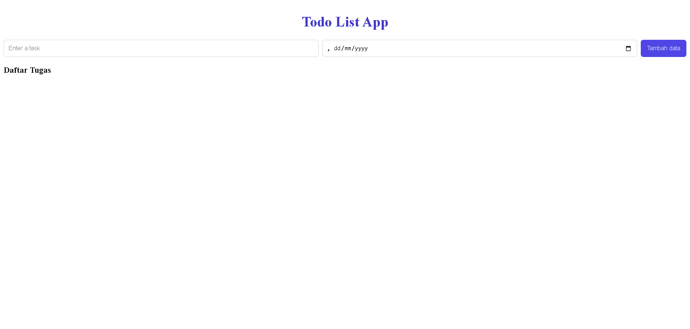
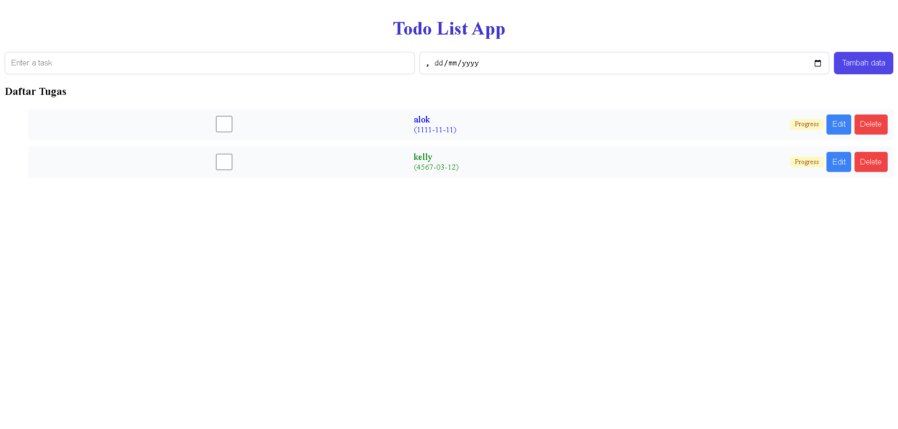

## Tampilan Program

### Tampilan Awal

### Tampilan Setelah Data Ditambahkan

<!-- QUOTE START -->

  
   
  
    
  <i>❝ Ketika aku menatap Kazehaya, aku tak bisa mengalihkan pandanganku. Mungkin karena itu, sebelum tidur wajah Kazehaya selalu muncul di pikiranku. Aku belum pernah merasakan perasaan spesial seperti ini sebelumnya. ❞</i>
   
  — <b>Sawako Kuronuma</b> · <i>Kimi ni Todoke 2nd Season</i>
    
  

<!-- QUOTE END -->
